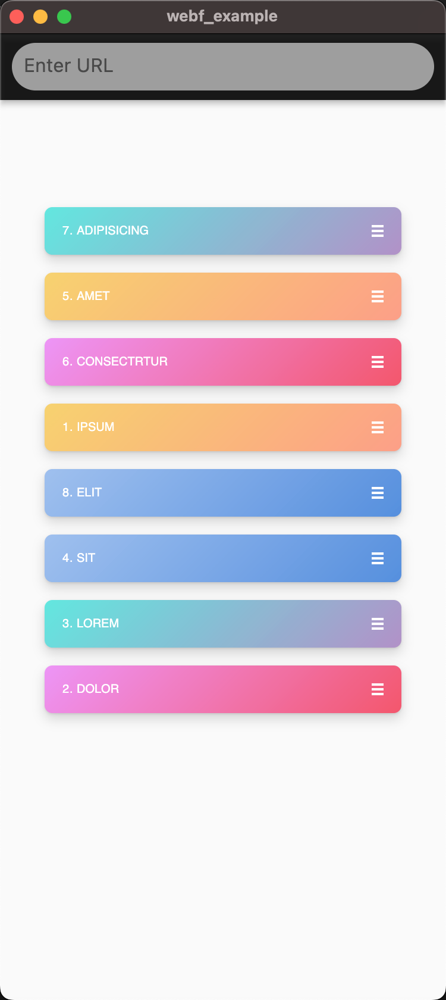

# Interactive Drag List



## How to run this demo

1.  Start your Front-End Dev Server

```
cd dragable-list
npm install
npm start
```

This will start a development server at `http://localhost:9999`.

**2. Load your application in WebF**

Run this demo with Flutter 3.10.x.

open app/lib/main.dart

Change the URL in `WebFBundle.fromUrl()` to `http://localhost:9999` to load your app.