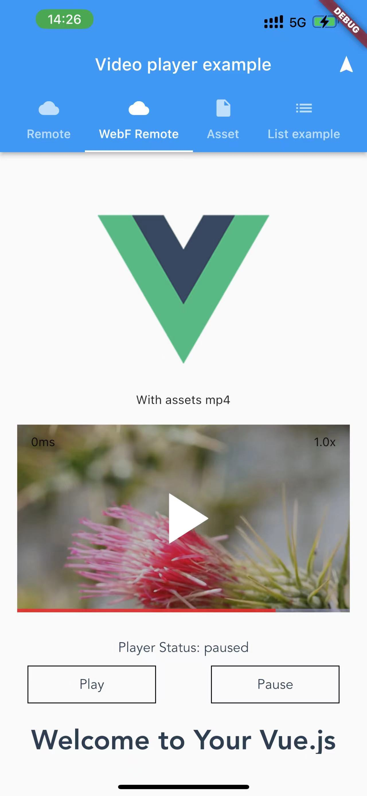

# Video Player

This demo shows how to use Flutter's video_player plugin to play videos in WebF apps.



## How to use

> This demo only works on Android/iOS devices.

Flutter version requirement: flutter 3.10.0

1. Make sure your devices are in the same WIFI network with your computer.

2. Start the front-end dev server.
```
cd app
npm install
npm run serve
```

The console will print the following messages:

```
 DONE  Compiled successfully in 94ms                                                                   2:20:31 PM

  App running at:
  - Local:   http://localhost:8080/
  - Network: http://172.20.10.3:8080/  <--- Copy this address
```

3. Change to WebF bundle url to your IP address.

open `app/lib/main.dart`


```
class _WebFRemoteVideoState extends State<_WebFRemoteVideo> {
  @override
  Widget build(BuildContext context) {
    final MediaQueryData queryData = MediaQuery.of(context);
    return WebF(
      viewportWidth: queryData.size.width,
      viewportHeight: 700,
      bundle: WebFBundle.fromUrl('http://<your_ip>:<your port>/'), // <--- Paste the address from step 2 to here.
    );
  }
}

```

4. flutter run